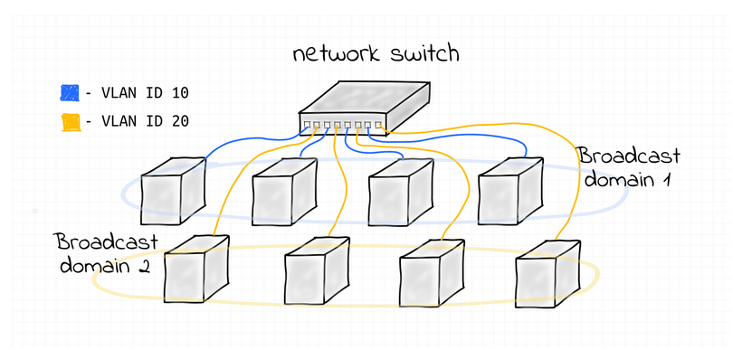

# VLAN multi-host

- Small scripts and a helper Python program for creating a bridge inside a network namespace.
- Attaching host namespaces to the bridge on specific VLAN IDs.
- Sending/receiving raw L2 Ethernet frames between hosts.



## Quick overview of scripts
| Script | Description |
|---|---|
| `create_bridge.sh` | <br><li>Create a network namespace. <br><li>Add a bridge device inside it. <br><li>bring up loopback and bridge. <br><li>Enable VLAN filtering.<br><br>**Usage**: `./create_bridge.sh <bridge-namespace> <bridge-if>` <br>e.g. `./create_bridge.sh bridge0 br0` |
| `create_host_for_bridge.sh` | <br><li>Create a host namespace, create a veth pair. <br><li>Place one end in the host namespace and the other in the bridge namespace. <br><li>Attach the peer to the bridge and set its VLAN (remove default VID 1 and add the specified VLAN as PVID).<br><br>**Usage**: `./create_host_for_bridge.sh <host-ns> <host-if> <vlan-id> <bridge-ns> <bridge-if>`<br>e.g. `./create_host_for_bridge.sh host10 eth10 10 bridge0 br0` |
| `ethsend.py` | <br><li>Sends an Ethernet frame over a raw AF_PACKET socket bound to the given interface. <br><li>Uses EtherType `0x7A05`. Requires CAP_NET_RAW (run with sudo).<br><br>**Usage**: `./ethsend.py <ifname> <dst-mac> <message>`<br>e.g. `./ethsend.py eth10 ff:ff:ff:ff:ff:ff "Hello"` |
| `listen_to_msg_on_host.sh` | <br><li>Runs `tcpdump` inside a host namespace to capture frames on the host veth interface. <br><li>Filtered by EtherType `0x7A05`.<br><br>**Usage**: `./listen_to_msg_on_host.sh <host-ns> <veth>`<br>e.g. `./listen_to_msg_on_host.sh host10 eth10` |
| `send_msg_to_host_mac.sh` | Runs `ethsend.py` inside the source namespace to send a frame to a destination MAC.<br><br>**Usage**: `sudo ./send_msg_to_host_mac.sh <src-ns> <if> <dst-mac> "<message>"`<br>e.g. `sudo ./send_msg_to_host_mac.sh host10 eth10 ff:ff:ff:ff:ff:ff "Hello VLAN 10"` |

## Prerequisites

- Linux with `ip` (iproute2) and `bridge` (iproute2) utilities installed.
- `tcpdump` for listening to packets.
- Python 3 available to run `ethsend.py`.
- Root privileges (sudo) to create namespaces, veths and to use raw sockets.

## Typical quick workflow (example)

1. Create a bridge namespace and bridge interface

```bash
# Create bridge namespace bridge0 and bridge interface br0 inside it
sudo bash create_bridge.sh bridge0 br0
```

2. Create two host namespaces and attach them to the bridge on different VLANs

```bash
# Create host10 attached to VLAN 10
sudo bash create_host_for_bridge.sh host10 eth10 10 bridge0 br0

# Create host20 attached to VLAN 20
sudo bash create_host_for_bridge.sh host20 eth20 20 bridge0 br0
```

3. Start listeners (in separate terminals) to capture frames from each host

```bash
# In terminal A
sudo ./listen_to_msg_on_host.sh host10 eth10

# In terminal B
sudo ./listen_to_msg_on_host.sh host20 eth20
```

4. Send a message from host10 to a destination MAC (unicast or broadcast)

```bash
# From the control shell (runs send script which executes ethsend.py inside host10 namespace)
sudo ./send_msg_to_host_mac.sh host10 eth10 ff:ff:ff:ff:ff:ff "Hello VLAN 10 clients"
```

## Notes

- Because VLAN filtering is enabled, frames from `host10` (VLAN 10) will not be delivered to `host20` (VLAN 20).
- `ethsend.py` uses EtherType `0x7A05`, and `listen_to_msg_on_host.sh` filters on that type, so only messages sent with `ethsend.py` (or with that EtherType) will be captured.

## Troubleshooting

- If `ip netns exec <ns> ip link show <if>` fails, verify the namespace and interface names are correct (interface naming is taken literally from the script arguments).
- If `ethsend.py` fails with a permission error, run it under `sudo` or grant CAP_NET_RAW to the Python interpreter.
- If you do not see frames on `tcpdump`, double-check that the listener is running in the correct namespace and on the correct interface name.

## Cleanup

```bash
# Example manual cleanup
sudo ip netns del host10 || true
sudo ip netns del host20 || true
sudo ip netns del bridge0 || true
```

(can also use `clear_netns.sh`in parent repo)

## License / Notes

- These scripts are small helpers for experimentation and testing of VLAN isolation and raw L2 frames inside network namespaces. Use them on a dedicated test machine or VM — they modify network namespaces and interfaces.

- If you do not see frames on `tcpdump`, double-check that the listener is running in the correct namespace and on the correct interface name.

